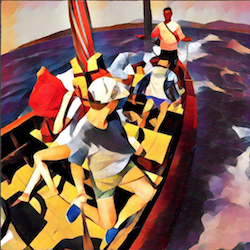

<h1> Neural Style Transfer </h1>
 
<h3> What is Style Transfer? </h3>
It is the technique of recomposing a given image (content image) in the style of another image (style image).

<h3> So how is it done? </h3>
We basically have to find the loss in the feature maps of the content image and the generated image which will give us the content loss. Then we find the style loss in the feature maps of the style image and the generated image. Their sum will give us the total loss. Our goal is to minimize the total loss. 

<h2> Working of the model - </h2>
We will be using a VGG-16 architecture pre-trained with "ImageNet" weights. 
In a Convolutional Neural Network the more deeper we go, more number of features are extracted. This means the image starts becoming definite (the main subject is extracted). So in order to find the content loss, we need feature maps of the deeper layers .i.e. the hidden layers close to the output. According to the original paper, 

p - original image 

x - generated image 

l - layer

F - feature map of layer l of the generated image 

P - feature map of layer l of the original image 

But for the style loss, as mentioned in [this article](https://medium.com/artists-and-machine-intelligence/neural-artistic-style-transfer-a-comprehensive-look-f54d8649c199), we won't be comparing the raw feature maps of the current and the generated image. Instead we will compare the Gram matrices of the resultant image array. Gram matrix of a vector is the dot product of the transpose of the vector and the vector itself. It is the matrix of all possible products in the space. According to the paper, 

And the loss is given by - 

G - Gram Matrix of the generated image feature map

A - Gram Matrix of the style image feature map

N - Number of distinct filters (Number of channels), usually 3 - RGB

M - Size of each feature map

w - weighting factor of each layer which is always 1/(number of layers)

So now that we have both the content loss and the style loss, it's time we compute the total loss which is to be minimized using L-BFGS optimizer. That is given by - 

alpha - content weight

beta - style weight

<h3> Results </h3>

Content Image - 

Style Image - 

If content weight is more than style weight - 

If style weight is more than content weight - 

As I executed it on a CPU, the process was slow. So I stopped it after around 25 epochs. 

**To run the model** - 

python model.py content.png style.png result --epoch 100 --content_weight 0.45 --style weight 1.85

**References**:
1. https://arxiv.org/abs/1508.06576 (Original Paper on Style Transfer)
2. https://medium.com/artists-and-machine-intelligence/neural-artistic-style-transfer-a-comprehensive-look-f54d8649c199 (Informative article on style transfer)
3. https://blog.slavv.com/picking-an-optimizer-for-style-transfer-86e7b8cba84b (Which optimizer to use to minimize loss function?)
